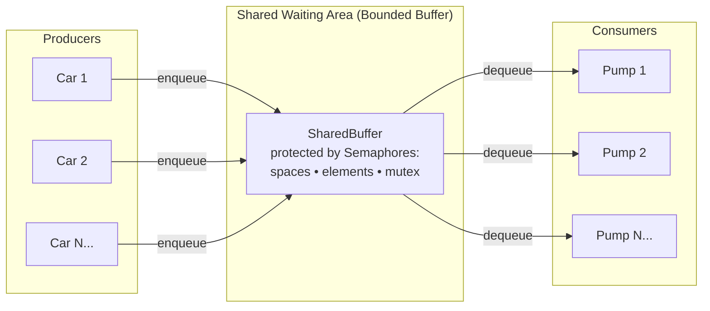

# ⛽ Synchronization OS — Gas Station Simulator

> A multithreaded **Producer–Consumer** simulation built in Java, modeling cars arriving at a gas station with limited waiting space and a fixed number of service pumps — synchronized using custom-built **semaphores**.

<p align="left">
  
  
  
  
</p>

---

## 📖 Overview

This project simulates a **gas station** as a classic synchronization problem from Operating Systems theory:

- 🚗 **Cars** arrive at random intervals and join a **waiting area** with limited capacity.
- ⛽ **Pumps** (service bays) take cars from the waiting area and service them one at a time.
- 🔒 Access to the shared waiting area is protected using a **custom Semaphore class** built from scratch on top of Java's `wait()` / `notifyAll()` — no built-in `java.util.concurrent.Semaphore` used.

It's a hands-on demonstration of the **bounded-buffer (producer–consumer) problem**, where:
- `Car` threads are **producers** → they enqueue themselves into the shared buffer.
- `Pump` threads are **consumers** → they dequeue cars and "service" them.

---

## 🏗️ Architecture



### 🔑 Synchronization primitives

| Semaphore | Purpose |
|---|---|
| `spaces` | Counts **empty slots** in the waiting area — blocks a car if the area is full. |
| `elements` | Counts **occupied slots** — blocks a pump if there's no car to service. |
| `mutex` | Guarantees **mutual exclusion** while a thread reads/writes the buffer pointers. |
| `serviceBays` | Tracks free **pumps**, used to log when a car must wait for service. |

This is the textbook **counting semaphore solution** to the bounded-buffer problem, implemented manually with Java's intrinsic locks.

---

## 📂 Project Structure

```
Synchronization-OS/
└── Sync/
    └── src/
        └── 20230416_20231088_20230113_20230042_20230370_CS7_8.java
            ├── Colors          → ANSI terminal color codes for readable output
            ├── Semaphore       → Custom counting semaphore (wait/signal)
            ├── SharedBuffer    → Bounded circular buffer (the waiting area)
            ├── Car             → Producer thread
            ├── Pump            → Consumer thread
            └── ServiceStation  → main() — wires everything together
```

> All classes live in a single file for simplicity — typical of an OS coursework submission.

---

## ▶️ How to Run

### Requirements
- JDK 8 or later (`java -version` / `javac -version` to check)

### Compile & Run

```bash
cd Sync/src
javac 20230416_20231088_20230113_20230042_20230370_CS7_8.java
java ServiceStation
```

### Sample Run

```
Enter waiting area capacity (1-10): 3
Enter number of service bays (pumps): 2
Enter cars arriving (space-separated, e.g., C1 C2 C3 C4 C5): C1 C2 C3 C4 C5

C1 arrived
C1 entered waiting area
Pump 1: C1 Occupied
Pump 1: C1 begins service at Bay 1
C2 arrived
C2 entered waiting area
Pump 2: C2 Occupied
Pump 2: C2 begins service at Bay 2
C3 arrived
C3 entered waiting area
...
All cars processed; simulation ends.
```

The console output is color-coded (🟡 car names, 🟣 pump activity, 🟢 success, 🔴 blocked/full states) for easy tracing of the synchronization behavior.

---

## 🧠 Key Concepts Demonstrated

- ✅ Custom **Semaphore** implementation using `wait()` / `notifyAll()`
- ✅ **Bounded-buffer / producer-consumer** synchronization pattern
- ✅ **Mutual exclusion** around shared circular buffer state
- ✅ Graceful **thread termination** via sentinel (`null`) values sent to consumers
- ✅ Configurable simulation parameters (buffer size, pump count, car list) via stdin

---

## 👥 Contributors

This project was developed as a team submission for an **Operating Systems** course assignment (CS7/8), covering the synchronization unit.

---

## 📜 License

This project was created for educational purposes as part of university coursework.
