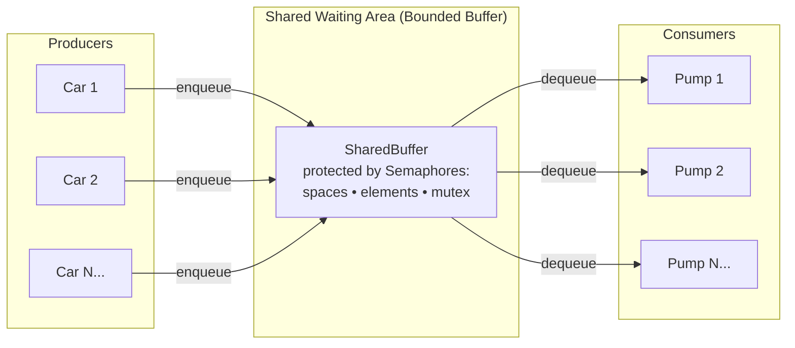

# Bounded Buffer Gas Station Simulation

A multithreaded **Producer–Consumer** simulation written in Java, modeling cars arriving at a gas station with limited waiting space and a fixed number of service pumps. Synchronization is handled by a custom-built semaphore implementation, not the Java standard library.

<p align="left">
  
  
  
  
</p>


## Overview

This project models a gas station as a classic synchronization problem from Operating Systems theory:

- **Cars** arrive at intervals and join a waiting area of fixed capacity.
- **Pumps** (service bays) draw cars from the waiting area and service them one at a time.
- Access to the shared waiting area is controlled by a **custom `Semaphore` class**, implemented from scratch using Java's intrinsic `wait()` / `notifyAll()` mechanisms — no `java.util.concurrent.Semaphore` is used.

It is a practical implementation of the **bounded-buffer (producer–consumer) problem**:

- `Car` threads act as **producers**, enqueuing themselves into the shared buffer.
- `Pump` threads act as **consumers**, dequeuing cars and servicing them.


## Architecture



### Synchronization primitives

| Semaphore | Purpose |
|---|---|
| `spaces` | Counts empty slots in the waiting area; blocks a car if the area is full. |
| `elements` | Counts occupied slots; blocks a pump if there is no car to service. |
| `mutex` | Guarantees mutual exclusion while a thread reads or writes the buffer pointers. |
| `serviceBays` | Tracks free pumps, used to log when a car must wait for a free bay. |

This is the standard counting-semaphore solution to the bounded-buffer problem, implemented manually on top of Java's intrinsic locks.


## Project Structure

```
Bounded-Buffer-Gas-Station-Simulation/
└── Sync/
    └── src/
        └── 20230416_20231088_20230113_20230042_20230370_CS7_8.java
            ├── Colors          → ANSI terminal color codes for readable output
            ├── Semaphore       → Custom counting semaphore (wait / signal)
            ├── SharedBuffer    → Bounded circular buffer (the waiting area)
            ├── Car             → Producer thread
            ├── Pump            → Consumer thread
            └── ServiceStation  → main() — wires everything together
```

All classes are kept in a single file, consistent with the original coursework submission format.


## How to Run

### Requirements
- JDK 8 or later (`java -version` / `javac -version` to verify)

### Compile and Run

```bash
cd Sync/src
javac 20230416_20231088_20230113_20230042_20230370_CS7_8.java
java ServiceStation
```

### Sample Run

```
Enter waiting area capacity (1-10): 3
Enter number of service bays (pumps): 2
Enter cars arriving (space-separated, e.g., C1 C2 C3 C4 C5): C1 C2 C3 C4 C5

C1 arrived
C1 entered waiting area
Pump 1: C1 Occupied
Pump 1: C1 begins service at Bay 1
C2 arrived
C2 entered waiting area
Pump 2: C2 Occupied
Pump 2: C2 begins service at Bay 2
C3 arrived
C3 entered waiting area
...
All cars processed; simulation ends.
```

Console output is color-coded by category (arrivals, pump activity, success, blocked/full states) to make the synchronization behavior easier to trace.


## Key Concepts Demonstrated

- Custom semaphore implementation using `wait()` / `notifyAll()`
- Bounded-buffer / producer-consumer synchronization pattern
- Mutual exclusion around shared circular buffer state
- Graceful thread termination via sentinel (`null`) values sent to consumers
- Configurable simulation parameters (buffer size, pump count, car list) via standard input


## Contributors

Developed as a team submission for an Operating Systems course assignment (CS7/8), covering the synchronization unit.

## License

Created for educational purposes as part of university coursework.
